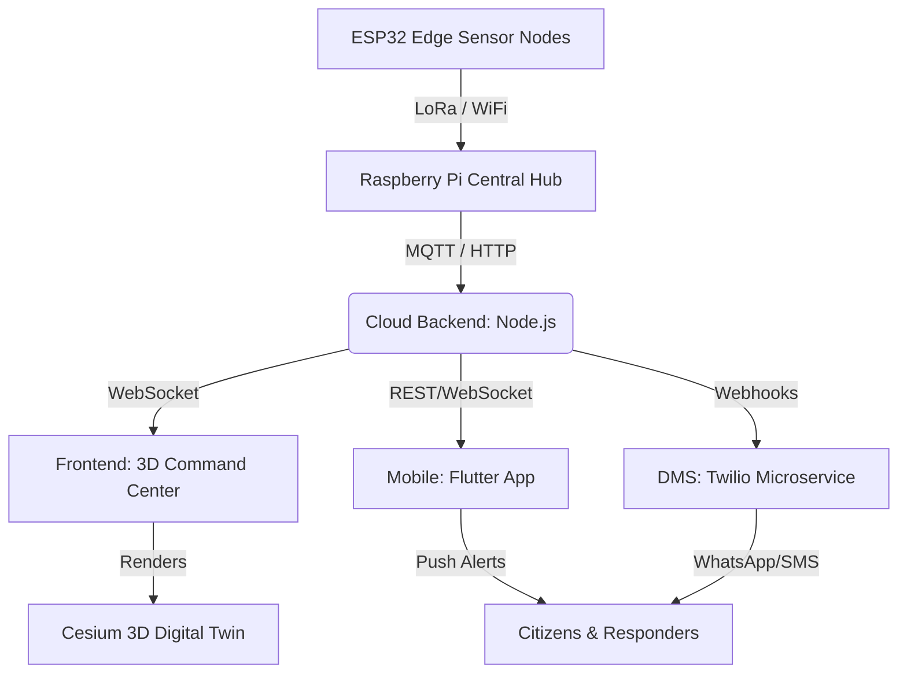

# 🏗️ System Architecture

IRIS is designed as a decentralized, fault-tolerant microservices architecture, heavily utilizing a hub-and-spoke hardware model for the sensor network.

## Component Architecture

## Module Breakdown
1. **Hardware Tier (ESP32 & Raspberry Pi)**: 
   - **ESP32 Nodes**: Low-power edge sensors collecting raw telemetry (soil moisture, vibration, temperature) running TinyML anomaly detection.
   - **Raspberry Pi Hub**: The central local processing gateway, aggregating data from multiple ESP32s, running mid-tier filtering, and reliably transmitting to the cloud.
2. **Frontend (Vite/React/Cesium)**: The strategic command dashboard. Heavily utilizes WebGL for 3D rendering of the digital twin.
3. **Backend (Node/Express)**: The data aggregation layer. Handles JWT authentication, MongoDB pooling, and real-time Socket.io dispatching.
4. **Mobile App (Flutter)**: The tactical edge. Provides offline-first maps, SOS triggering, and localized notifications.
5. **DMS Microservice**: Isolated Node script to handle API limits and queuing for Twilio WhatsApp and SMS dispatches.
